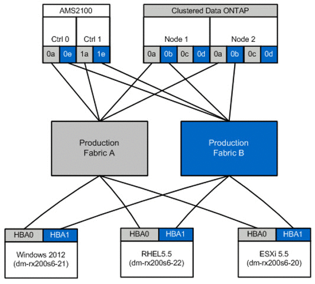

= 대상 영역에 호스트 생성
:allow-uri-read: 
:icons: font
:imagesdir: ../media/

[role="lead"]
대상 존에 대한 호스트를 생성해야 합니다. 운영 Fabric에는 패브릭 A와 패브릭 B라는 두 가지 유형이 있습니다

다음은 호스트 및 대상 스토리지 조닝의 그림입니다.

생산 구역 A에서 사용 가능

[cols="3*"]
|===
| Zone(영역) | WWPN입니다 | 영역 구성원 

 a| 
영역: rx21_flickDOT
 a| 
21:00:00:24:ff:30:14:C5

20:01:00:a0:98:2f:94:d1

20:03:00:a0:98:2f:94:d1
 a| 
RX21 HBA 0

FlifDOT liff 1(웨이브 리프트1

FlickDOT liff 3

 a| 
영역: rx22_flickDOT
 a| 
21:00:00:24:ff:30:04:85

20:01:00:a0:98:2f:94:d1

20:03:00:a0:98:2f:94:d1
 a| 
RX22 HBA 0

FlifDOT liff 1(웨이브 리프트1

FlickDOT liff 3

 a| 
영역: rx20_flickDOT
 a| 
21:00:00:24:ff:30:03:ea

20:01:00:a0:98:2f:94:d1

20:03:00:a0:98:2f:94:d1
 a| 
RX20 HBA 0

FlifDOT liff 1(웨이브 리프트1

FlickDOT liff 3

|===
운영 패브릭 B에서 사용 가능한 운영 영역

[cols="3*"]
|===
| Zone(영역) | WWPN입니다 | 영역 구성원 

 a| 
영역: rx21_flickDOT
 a| 
21:00:00:24:ff:30:14:C4

20:02:00:a0:98:2f:94:d1

20:04:00:a0:98:2f:94:d1
 a| 
RX21 HBA 1

FlifDOT liff 2(웨이브 생년월일2

FlickDOT liff 4

 a| 
영역: rx22_flickDOT
 a| 
21:00:00:24:ff:30:04:84

20:02:00:a0:98:2f:94:d1

20:04:00:a0:98:2f:94:d1
 a| 
RX22 HBA 1

FlifDOT liff 2(웨이브 생년월일2

FlickDOT liff 4

 a| 
영역: rx20_flickDOT
 a| 
21:00:00:24:ff:30:03:eb

20:02:00:a0:98:2f:94:d1

20:04:00:a0:98:2f:94:d1
 a| 
RX20 HBA 1

FlifDOT liff 2(웨이브 생년월일2

FlickDOT liff 4

|===