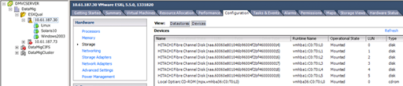

= ESXi 호스트에 대한 다중 경로 검증
:allow-uri-read: 
:icons: font
:imagesdir: ../media/

[role="lead"]
FLI(Foreign LUN Import) 프로세스의 일환으로 다중 경로가 호스트에서 올바르게 구성되고 작동하는지 확인해야 합니다.

ESXi 호스트에 대해 다음 단계를 완료합니다.

.단계
. VMware vSphere Client를 사용하여 ESXi 및 가상 머신을 확인합니다.
+
image::../media/esxi_host_1.png[vSphere 스토리지 데이터 저장소]

. vSphere Client를 사용하여 마이그레이션할 SAN LUN을 결정합니다.
+

. 마이그레이션할 VMFS 및 RDM(vfat) 볼륨을 결정합니다. 'esxcli storage filesystem list'
+
[listing]
----
Mount Point                                        Volume Name        UUID                                 Mounted  Type           Size         Free
-------------------------------------------------  -----------------  -----------------------------------  -------  ------  -----------  -----------
/vmfs/volumes/538400f6-3486df59-52e5-00262d04d700  BootLun_datastore  538400f6-3486df59-52e5-00262d04d700     true  VMFS-5  13421772800  12486443008
/vmfs/volumes/53843dea-5449e4f7-88e0-00262d04d700  VM_datastore       53843dea-5449e4f7-88e0-00262d04d700     true  VMFS-5  42681237504   6208618496
/vmfs/volumes/538400f6-781de9f7-c321-00262d04d700                     538400f6-781de9f7-c321-00262d04d700     true  vfat     4293591040   4269670400
/vmfs/volumes/c49aad7f-afbab687-b54e-065116d72e55                     c49aad7f-afbab687-b54e-065116d72e55     true  vfat      261853184     77844480
/vmfs/volumes/270b9371-8fbedc2b-1f3b-47293e2ce0da                     270b9371-8fbedc2b-1f3b-47293e2ce0da     true  vfat      261853184    261844992
/vmfs/volumes/538400ef-647023fa-edef-00262d04d700                     538400ef-647023fa-edef-00262d04d700     true  vfat      299712512     99147776
~ #
----
+
[NOTE]
====
extends \(스팬 VMFS\)가 있는 VMFS의 경우 스팬 중 일부인 모든 LUN을 마이그레이션해야 합니다. GUI에서 모든 확장을 표시하려면 구성\>하드웨어\>스토리지 로 이동한 다음 데이터 저장소 를 클릭하여 속성 링크를 선택합니다.

====
+
[NOTE]
====
마이그레이션 후 다시 스토리지에 추가하는 동안 동일한 VMFS 레이블이 있는 여러 LUN 항목이 표시됩니다. 이 시나리오에서는 고객에게 머리로 표시된 항목만 선택하도록 요청해야 합니다.

====
. 마이그레이션할 LUN과 크기를 결정합니다. esxcfg-scsidevs-c
+
[listing]
----
Device UID                            Device Type      Console Device                                            Size      Multipath PluginDisplay Name
mpx.vmhba36:C0:T0:L0                  CD-ROM           /vmfs/devices/cdrom/mpx.vmhba36:C0:T0:L0                  0MB       NMP     Local Optiarc CD-ROM (mpx.vmhba36:C0:T0:L0)
naa.60060e801046b96004f2bf4600000014  Direct-Access    /vmfs/devices/disks/naa.60060e801046b96004f2bf4600000014  20480MB   NMP     HITACHI Fibre Channel Disk (naa.60060e801046b96004f2bf4600000014)
naa.60060e801046b96004f2bf4600000015  Direct-Access    /vmfs/devices/disks/naa.60060e801046b96004f2bf4600000015  40960MB   NMP     HITACHI Fibre Channel Disk (naa.60060e801046b96004f2bf4600000015)
~~~~~~ Output truncated ~~~~~~~
~ #
----
. 마이그레이션할 RDM(Raw Device Mapping) LUN을 식별합니다.
. RDM 디바이스 찾기: "+find/VMFS/volumes-name**-RDM**+
+
[listing]
----
/vmfs/volumes/53843dea-5449e4f7-88e0-00262d04d700/Windows2003/Windows2003_1-rdmp.vmdk
/vmfs/volumes/53843dea-5449e4f7-88e0-00262d04d700/Windows2003/Windows2003_2-rdm.vmdk
/vmfs/volumes/53843dea-5449e4f7-88e0-00262d04d700/Linux/Linux_1-rdm.vmdk
/vmfs/volumes/53843dea-5449e4f7-88e0-00262d04d700/Solaris10/Solaris10_1-rdmp.vmdk
----
. 앞의 출력에서 -Rdmp 및 -RDM을 제거하고 vmkfstools 명령을 실행하여 VML 매핑 및 RDM 유형을 찾습니다.
+
[listing]
----
# vmkfstools -q /vmfs/volumes/53843dea-5449e4f7-88e0-00262d04d700/Windows2003/Windows2003_1.vmdk
vmkfstools -q /vmfs/volumes/53843dea-5449e4f7-88e0-00262d04d700/Windows2003/Windows2003_1.vmdk
Disk /vmfs/volumes/53843dea-5449e4f7-88e0-00262d04d700/Windows2003/Windows2003_1.vmdk is a Passthrough Raw Device Mapping
Maps to: vml.020002000060060e801046b96004f2bf4600000016444636303046
~ # vmkfstools -q /vmfs/volumes/53843dea-5449e4f7-88e0-00262d04d700/Windows2003/Windows2003_2.vmdk
Disk /vmfs/volumes/53843dea-5449e4f7-88e0-00262d04d700/Windows2003/Windows2003_2.vmdk is a Non-passthrough Raw Device Mapping
Maps to: vml.020003000060060e801046b96004f2bf4600000017444636303046
~ # vmkfstools -q /vmfs/volumes/53843dea-5449e4f7-88e0-00262d04d700/Linux/Linux_1.vmdk
Disk /vmfs/volumes/53843dea-5449e4f7-88e0-00262d04d700/Linux/Linux_1.vmdk is a Non-passthrough Raw Device Mapping
Maps to: vml.020005000060060e801046b96004f2bf4600000019444636303046
~ # vmkfstools -q /vmfs/volumes/53843dea-5449e4f7-88e0-00262d04d700/Solaris10/Solaris10_1.vmdk
Disk /vmfs/volumes/53843dea-5449e4f7-88e0-00262d04d700/Solaris10/Solaris10_1.vmdk is a Passthrough Raw Device Mapping
Maps to: vml.020004000060060e801046b96004f2bf4600000018444636303046
~ #
----
+
[NOTE]
====
패스스루는 물리적 \(Rdmp\)가 있는 RDM으로, 비패스스루는 가상 \(RDMV\)가 있는 RDM입니다. VM 스냅샷 델타 vmdk가 오래된 naa ID가 있는 RDM을 가리키기 때문에 가상 RDM과 VM 스냅샷 복제본이 있는 VM이 마이그레이션 후 중단 됩니다. 따라서 마이그레이션을 수행하기 전에 고객에게 그러한 VM의 스냅샷 복사본을 모두 제거하도록 요청하십시오. VM을 마우스 오른쪽 버튼으로 클릭하고 Snapshot---\>Snapshot Manager Delete All 버튼을 클릭합니다. NetApp 스토리지의 VMware 하드웨어 가속 잠금에 대한 자세한 내용은 NetApp KB 3013935를 참조하십시오.

====
. LUN naa와 RDM 디바이스 간의 매핑을 식별합니다.
+
[listing]
----
~ # esxcfg-scsidevs -u | grep vml.020002000060060e801046b96004f2bf4600000016444636303046
naa.60060e801046b96004f2bf4600000016                            vml.020002000060060e801046b96004f2bf4600000016444636303046
~ # esxcfg-scsidevs -u | grep vml.020003000060060e801046b96004f2bf4600000017444636303046
naa.60060e801046b96004f2bf4600000017                            vml.020003000060060e801046b96004f2bf4600000017444636303046
~ # esxcfg-scsidevs -u | grep vml.020005000060060e801046b96004f2bf4600000019444636303046
naa.60060e801046b96004f2bf4600000019                            vml.020005000060060e801046b96004f2bf4600000019444636303046
~ # esxcfg-scsidevs -u | grep vml.020004000060060e801046b96004f2bf4600000018444636303046
naa.60060e801046b96004f2bf4600000018                            vml.020004000060060e801046b96004f2bf4600000018444636303046
~ #
----
. 가상 시스템 구성: 'esxcli storage filesystem list | grep VMFS'를 확인합니다
+
[listing]
----
/vmfs/volumes/538400f6-3486df59-52e5-00262d04d700  BootLun_datastore  538400f6-3486df59-52e5-00262d04d700     true  VMFS-5  13421772800  12486443008
/vmfs/volumes/53843dea-5449e4f7-88e0-00262d04d700  VM_datastore       53843dea-5449e4f7-88e0-00262d04d700     true  VMFS-5  42681237504   6208618496
~ #
----
. 데이터 저장소의 UUID를 기록합니다.
. "/etc/vmware/hostd/vmInventory.xml"의 복제본을 만들고 파일 및 vmx 구성 경로의 내용을 기록합니다.
+
[listing]
----
~ # cp /etc/vmware/hostd/vmInventory.xml /etc/vmware/hostd/vmInventory.xml.bef_mig
~ # cat /etc/vmware/hostd/vmInventory.xml
<ConfigRoot>
  <ConfigEntry id="0001">
    <objID>2</objID>
    <vmxCfgPath>/vmfs/volumes/53843dea-5449e4f7-88e0-00262d04d700/Windows2003/Windows2003.vmx</vmxCfgPath>
  </ConfigEntry>
  <ConfigEntry id="0004">
    <objID>5</objID>
    <vmxCfgPath>/vmfs/volumes/53843dea-5449e4f7-88e0-00262d04d700/Linux/Linux.vmx</vmxCfgPath>
  </ConfigEntry>
  <ConfigEntry id="0005">
    <objID>6</objID>
    <vmxCfgPath>/vmfs/volumes/53843dea-5449e4f7-88e0-00262d04d700/Solaris10/Solaris10.vmx</vmxCfgPath>
  </ConfigEntry>
</ConfigRoot>
----
. 가상 머신 하드 디스크를 식별합니다.
+
제거된 RDM 디바이스를 순서대로 추가하려면 이 정보가 마이그레이션 후 필요합니다.

+
[listing]
----
~ # grep fileName /vmfs/volumes/53843dea-5449e4f7-88e0-00262d04d700/Windows2003/Windows2003.vmx
scsi0:0.fileName = "Windows2003.vmdk"
scsi0:1.fileName = "Windows2003_1.vmdk"
scsi0:2.fileName = "Windows2003_2.vmdk"
~ # grep fileName /vmfs/volumes/53843dea-5449e4f7-88e0-00262d04d700/Linux/Linux.vmx
scsi0:0.fileName = "Linux.vmdk"
scsi0:1.fileName = "Linux_1.vmdk"
~ # grep fileName /vmfs/volumes/53843dea-5449e4f7-88e0-00262d04d700/Solaris10/Solaris10.vmx
scsi0:0.fileName = "Solaris10.vmdk"
scsi0:1.fileName = "Solaris10_1.vmdk"
~ #
----
. RDM 디바이스, 가상 머신 매핑 및 호환성 모드를 확인합니다.
. 위의 정보를 사용하여 디바이스, 가상 머신, 호환성 모드 및 순서에 대한 RDM 매핑을 기록합니다.
+
나중에 VM에 RDM 디바이스를 추가할 때 이 정보가 필요합니다.

+
[listing]
----
Virtual Machine -> Hardware -> NAA -> Compatibility mode
Windows2003 VM -> scsi0:1.fileName = "Windows2003_1.vmdk" -> naa.60060e801046b96004f2bf4600000016
-> RDM Physical
Windows2003 VM -> scsi0:2.fileName = "Windows2003_2.vmdk" -> naa.60060e801046b96004f2bf4600000017
-> RDM Virtual
Linux VM -> scsi0:1.fileName = “Linux_1.vmdk” -> naa.60060e801046b96004f2bf4600000019 -> RDM Virtual
Solaris10 VM -> scsi0:1.fileName = “Solaris10_1.vmdk” -> naa.60060e801046b96004f2bf4600000018 -> RDM Physical
----
. 다중 경로 구성을 확인합니다.
. vSphere Client에서 스토리지에 대한 다중 경로 설정을 가져옵니다.
+
.. vSphere Client에서 ESX 또는 ESXi 호스트를 선택하고 Configuration 탭을 클릭합니다.
.. 스토리지 * 를 클릭합니다.
.. 데이터 저장소 또는 매핑된 LUN을 선택합니다.
.. 속성 * 을 클릭합니다.
.. 필요한 경우 속성 대화 상자에서 원하는 범위를 선택합니다.
.. Extent Device * > * Manage Paths * 를 클릭하고 Manage Path 대화 상자에서 경로를 가져옵니다.
+
image::../media/esxi_host_3.png[vSphere 스토리지 디바이스 경로]

. ESXi 호스트 명령줄에서 LUN 경로 다중화 정보를 가져옵니다.
+
.. ESXi 호스트 콘솔에 로그인합니다.
.. esxcli storage nmp device list 를 실행하여 다중 경로 정보를 가져옵니다.
+
[listing]
----
# esxcli storage nmp device list
naa.60060e801046b96004f2bf4600000014
   Device Display Name: HITACHI Fibre Channel Disk (naa.60060e801046b96004f2bf4600000014)
   Storage Array Type: VMW_SATP_DEFAULT_AA
   Storage Array Type Device Config: SATP VMW_SATP_DEFAULT_AA does not support device configuration.
   Path Selection Policy: VMW_PSP_RR
   Path Selection Policy Device Config: {policy=rr,iops=1000,bytes=10485760,useANO=0; lastPathIndex=3: NumIOsPending=0,numBytesPending=0}
   Path Selection Policy Device Custom Config:
   Working Paths: vmhba2:C0:T1:L0, vmhba2:C0:T0:L0, vmhba1:C0:T1:L0, vmhba1:C0:T0:L0
   Is Local SAS Device: false
   Is Boot USB Device: false

naa.60060e801046b96004f2bf4600000015
   Device Display Name: HITACHI Fibre Channel Disk (naa.60060e801046b96004f2bf4600000015)
   Storage Array Type: VMW_SATP_DEFAULT_AA
   Storage Array Type Device Config: SATP VMW_SATP_DEFAULT_AA does not support device configuration.
   Path Selection Policy: VMW_PSP_RR
   Path Selection Policy Device Config: {policy=rr,iops=1000,bytes=10485760,useANO=0; lastPathIndex=0: NumIOsPending=0,numBytesPending=0}
   Path Selection Policy Device Custom Config:
   Working Paths: vmhba2:C0:T1:L1, vmhba2:C0:T0:L1, vmhba1:C0:T1:L1, vmhba1:C0:T0:L1
   Is Local SAS Device: false
   Is Boot USB Device: false

naa.60060e801046b96004f2bf4600000016
   Device Display Name: HITACHI Fibre Channel Disk (naa.60060e801046b96004f2bf4600000016)
   Storage Array Type: VMW_SATP_DEFAULT_AA
   Storage Array Type Device Config: SATP VMW_SATP_DEFAULT_AA does not support device configuration.
   Path Selection Policy: VMW_PSP_RR
   Path Selection Policy Device Config: {policy=rr,iops=1000,bytes=10485760,useANO=0; lastPathIndex=1: NumIOsPending=0,numBytesPending=0}
   Path Selection Policy Device Custom Config:
   Working Paths: vmhba2:C0:T1:L2, vmhba2:C0:T0:L2, vmhba1:C0:T1:L2, vmhba1:C0:T0:L2
   Is Local SAS Device: false
   Is Boot USB Device: false

naa.60060e801046b96004f2bf4600000017
   Device Display Name: HITACHI Fibre Channel Disk (naa.60060e801046b96004f2bf4600000017)
   Storage Array Type: VMW_SATP_DEFAULT_AA
   Storage Array Type Device Config: SATP VMW_SATP_DEFAULT_AA does not support device configuration.
   Path Selection Policy: VMW_PSP_RR
   Path Selection Policy Device Config: {policy=rr,iops=1000,bytes=10485760,useANO=0; lastPathIndex=1: NumIOsPending=0,numBytesPending=0}
   Path Selection Policy Device Custom Config:
   Working Paths: vmhba2:C0:T1:L3, vmhba2:C0:T0:L3, vmhba1:C0:T1:L3, vmhba1:C0:T0:L3
   Is Local SAS Device: false
   Is Boot USB Device: false

naa.60060e801046b96004f2bf4600000018
   Device Display Name: HITACHI Fibre Channel Disk (naa.60060e801046b96004f2bf4600000018)
   Storage Array Type: VMW_SATP_DEFAULT_AA
   Storage Array Type Device Config: SATP VMW_SATP_DEFAULT_AA does not support device configuration.
   Path Selection Policy: VMW_PSP_RR
   Path Selection Policy Device Config: {policy=rr,iops=1000,bytes=10485760,useANO=0; lastPathIndex=1: NumIOsPending=0,numBytesPending=0}
   Path Selection Policy Device Custom Config:
   Working Paths: vmhba2:C0:T1:L4, vmhba2:C0:T0:L4, vmhba1:C0:T1:L4, vmhba1:C0:T0:L4
   Is Local SAS Device: false
   Is Boot USB Device: false

naa.60060e801046b96004f2bf4600000019
   Device Display Name: HITACHI Fibre Channel Disk (naa.60060e801046b96004f2bf4600000019)
   Storage Array Type: VMW_SATP_DEFAULT_AA
   Storage Array Type Device Config: SATP VMW_SATP_DEFAULT_AA does not support device configuration.
   Path Selection Policy: VMW_PSP_RR
   Path Selection Policy Device Config: {policy=rr,iops=1000,bytes=10485760,useANO=0; lastPathIndex=1: NumIOsPending=0,numBytesPending=0}
   Path Selection Policy Device Custom Config:
   Working Paths: vmhba2:C0:T1:L5, vmhba2:C0:T0:L5, vmhba1:C0:T1:L5, vmhba1:C0:T0:L5
   Is Local SAS Device: false
   Is Boot USB Device: false
----

