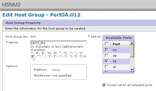

= ONTAP 스토리지에서 소스 LUN을 제거하는 중입니다
:allow-uri-read: 
:icons: font
:imagesdir: ../media/

[role="lead"]
다음 단계에서는 마이그레이션이 완료된 후 ONTAP 스토리지에서 소스 LUN을 제거하는 방법을 설명합니다.

NOTE: 이 작업에서는 예제에 _HDS AMS2100_어레이를 사용합니다. 다른 어레이 또는 다른 버전의 어레이 GUI를 사용하는 경우 작업이 다를 수 있습니다.

.단계
. Hitachi Storage Navigator Modular에 로그인합니다.
. 계획 단계 중에 생성된 ONTAP 호스트 그룹을 선택하고 * 호스트 그룹 편집 * 을 선택합니다.
+
image::../media/remove_source_luns_from_ontap_storage_1.png[호스트 그룹]

. 포트 * 를 선택하고 선택한 모든 포트에 대해 * 강제 설정 * 을 선택합니다.
+

. 할당된 논리 LUN에서 마이그레이션되는 호스트 LUN을 선택합니다. 소스 LUN 워크시트에 언급된 각 호스트에 대해 LUN 이름을 사용합니다. 여기에서 Windows 2012, RHEL 5.10 및 ESXi 5.5 호스트의 LUN을 선택하고 * Remove * 를 선택합니다.
+
image::../media/remove_source_luns_from_ontap_storage_3.png[LUN 제거]

